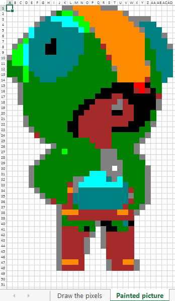

# pixeliazo
Convert images to Excel spreadsheet with color index values for kids to draw.

This script takes an image and converts it to an Excel spreadsheet with
cells filled with numbers representing the color index values of the
image. Image is recolored with a maximum of 32 standard common colors.
It allows scaling down of the image and provides the option to recolor
the image with less number of colors (between 2 and 32 inclusive).  

The purpose of the script is to create educational coloring exercises for
small kids to understand image representation in computer science.  

The created Excel file contains 2 spreadsheets and will have the image's
name with the suffix '.xlsx'. The first spreadsheet is a grid with values
corresponding to the pixel colors and a legend with the indices and color
names.  

The second spreadsheet has cells with backgound colors according to
the image. Both spreadsheets' cells are square formatted.  

Dependecies
-----------
Script requires:
* Pillow (Python Imaging Library fork) and
* openpyxl (Python library to read/write Excel 2010 files)  

Install dependecies:
* pip3 install Pillow
* pip3 install openpyxl

Usage
-----
* pixeliazo.py image [--width `int`] [--colors `int`] [--lang `str`]
* pixeliazo.py (-h | --help)

Options:  
* -h, --help  
    Show help message and exit.  
* image  
    The image filename that will be used as input.  
* -w, --width `int`  
    Force scaling to the width provided. Width must be greater than 0.  
* -c, --colors `int`  
    Recolor the image with the specified number of colors (including white).
    32 standard colors are used if omitted or not valid (between 2 and 32
    inclusive).  
* -l, --lang `str`  
    Language to be used for the legend in the output spreadsheet. Default
    is 'en' (English).  
* -r, --resample `str`
    Resample filter to be used while resizing. It is ignored if resizing width
    is not set or if an invalid option given. Available options: NEAREST, BOX,
    BILINEAR, HAMMING, BICUBIC or LANCZOS. Use NEAREST if image is already in
    pixel art form. Default is BICUBIC.  

Examples
--------
* pixeliazo.py funny_image.jpg  
    funny_image.jpg.xlsx will be created.
* pixeliazo.py another_image.png --width 20  
    Image will be rescaled to 20 pixels width and the proportional
    height. 32 standard common colors will be used.
* pixeliazo.py example_image.jpg --width 20 -c 5  
    Image will be rescaled and recolored with 5 common colors. A legend
    with 5 indeces (4 if white is used) and color names will be added
    to the first spreadsheet.
* pixeliazo.py awesome_image.jpg -w 20 -c 5 --lang el  
    Image will be rescaled and recolored and a legend with indeces
    and color names will be added. Color names and captions will have
    Greek names.
* pixeliazo.py pixel_image.jpg -w 20 -r NEAREST  
    Image will be rescaled using NEAREST resample filter (this is ideal if
    your image is already in pixel art form).
